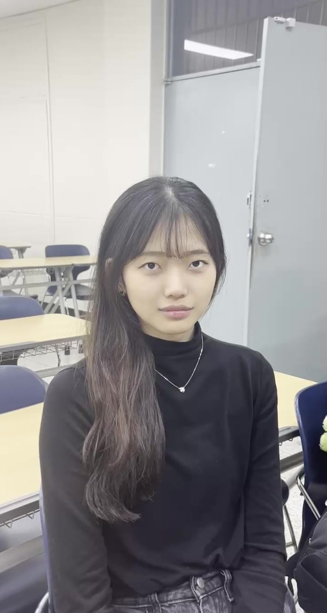
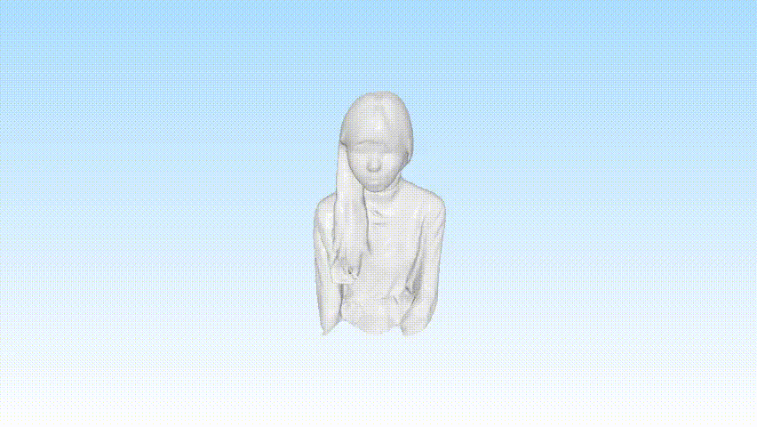

# Direct3D: Scalable Image-to-3D Generation via 3D Latent Diffusion Transformer (NeurIPS 2024)

---

This repository is for environment setup and inference of the paper "Direct3D: Scalable Image-to-3D Generation via 3D Latent Diffusion Transformer" (NeurIPS 2024).
It contains the minimal code and instructions required to run inference using pretrained weights from the official implementation.


Below is an example of image-to-3D generation using Direct3D.

---

### Input Image



### Output Mesh (Video)



[▶watch the output video](assets/output1.mp4)

---

### Installation

```sh
git clone https://github.com/DreamTechAI/Direct3D.git

cd Direct3D

pip install -r requirements.txt

pip install -e .
```

### Usage

```python
from direct3d.pipeline import Direct3dPipeline
pipeline = Direct3dPipeline.from_pretrained("DreamTechAI/Direct3D")
pipeline.to("cuda")
mesh = pipeline(
    "assets/input1.png",
    remove_background=False, # set to True if the background of the image needs to be removed
    mc_threshold=-1.0,
    guidance_scale=4.0,
    num_inference_steps=50,
)["meshes"][0]
mesh.export("output.obj")
```

## Acknowledgements

Thanks to the following repos for their great work, which helps us a lot in the development of Direct3D:

- [3DShape2VecSet](https://github.com/1zb/3DShape2VecSet/tree/master)
- [Michelangelo](https://github.com/NeuralCarver/Michelangelo)
- [Objaverse](https://objaverse.allenai.org/)
- [diffusers](https://github.com/huggingface/diffusers)


